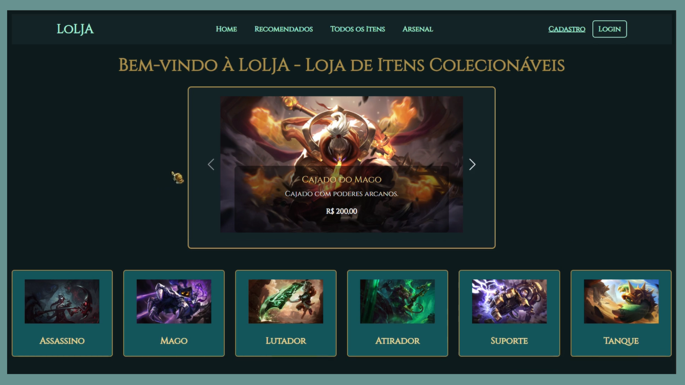

## Projeto

Trabalho de final da disciplina Programação Web desenvolvido juntamente com Carolina Rabello, Italo Vieck e Lucas Henrique. 
 

## Detalhes

E-commerce especializado na venda de itens colecionáveis inspirados no universo de League of Legends. Toda a interface e estética do site foram cuidadosamente desenvolvidas para replicar a identidade visual e a ambientação do jogo, proporcionando ao usuário uma experiência imersiva e temática.

Funcionalidades principais:
* Catálogo de produtos colecionáveis com imagens, descrições e preços, inspirado nos campeões e itens do LoL.
* Sistema de busca e ordenação por:
- Classe (ex: mago, atirador, tanque)
- Nome
- Preço (crescente ou decrescente)
* Controle de sessão e autenticação de usuários, com funcionalidades distintas para usuários comuns e administradores.
* Área administrativa (painel CRUD):
- Cadastro, edição, exclusão e listagem de produtos.
- Gerenciamento de usuários e pedidos.
* Integração com a API ViaCEP para preenchimento automático de endereços no checkout, otimizando o processo de finalização da compra.

## Preview
